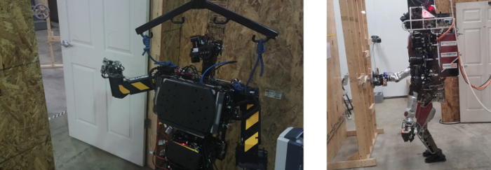
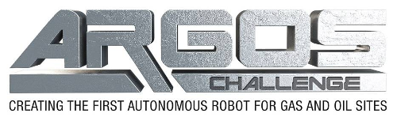
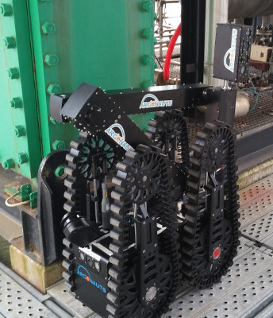
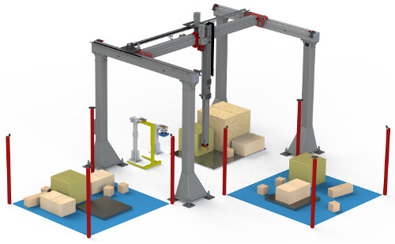

Applications
============

.. .. note::

..    This 'Applications' page is taken from the previous website. It has not been updated!

DARPA Robotics Challenge
------------------------

The DRC was the main purpose for which FlexBE has originally been developed.
As the high-level behavior control approach for one of the ATLAS teams, `Team ViGIR <http://www.theroboticschallenge.org/finalist/vigir>`_, it primarily provides a framework enabling to flexibly design behaviors for complex tasks in challenging environments.
Cooperating with Team ViGIR, also `Team Hector <http://www.theroboticschallenge.org/finalist/team-hector>`_ chose FlexBE for their high-level control.

.. youtube:: lu2b4qQmjgA
   :width: 320
   :align: left

This video shows the first test of a behavior to let the ATLAS robot of Team ViGIR turn a valve in prepation for the DRC Finals.
In order to reduce the risk of damaging hardware during this first test, the robot does not yet have hands and the valve is only virtually placed.
In the video, you can see the Runtime Control view of FlexBE's user interface.
Depending on the selected Autonomy Level, transitions are blocked and need to be confirmed by the operator.
When planning how to approach the valve for the first time at *0:40*, the robot comes up with a non-optimal plan.
Consequently, the operator rejects the robot's request to continue and forces it to re-plan, resulting in a much better plan.
Without the close operator integration enabled by FlexBE, the operator would not have been able react accordingly.
Later, when turning the valve had been successful once, the operator switches to full autonomy, being confident the robot is able to handle this repetitive task by itself.

|

.. Raw HTML was implemented here to implement appropriate text wrapping! Not supported by rST.

ARGOS Challenge
---------------

In contrast to the DRC, focus of the ARGOS challenge is the autonomous control of a robot in a defined environment.
The tasks mainly consist of patrolling and checking measured values of site instruments.
Nevertheless, `Team Argonauts <http://argos-challenge.com/en/team-argonauts>`_ decided to choose FlexBE as their high-level control approach.

Although running behaviors in full autonomy during the challenge, the options to block or force certain transitions by a human operator helped a lot during development.
Furthermore, monitoring the internal runtime state of a behavior during execution was an important requirement for the challenge and provided out-of-the-box by FlexBE.
Finally, the teams just had twenty minutes preparation time per mission before they had to start their runs.
While other teams were struggling to complete preparing their robot's mission specification within time, Team Argonauts was able to do so in less than five minutes per mission, using FlexBE's graphical editor and code generation.

For most of the missions, the robot had to climb a step onto the site and afterwards continue with proceeding to measurement instruments.
During an interruption in one of the missions at the second competition day, the robot was put into an unexpected situation from where the prepared behavior would not have been able to proceed with the mission.
However, the operator was able to make use of FlexBE's capability to modify a behavior during runtime and adapted the behavior to this new situation during the run without problems.

STRANDS Summer School
---------------------

Not only has FlexBE been used for competitions or along with rescue robots.
At a summer school in the context of the EU project `STRANDS <http://strands.acin.tuwien.ac.at/>`_, groups had the chance to implement a task of their choice on one of the project's robots and run a demonstration of it at the welcome reception of the European Conference on Mobile Robots (ECMR).
For this purpose, FlexBE has been used to implement an autonomously executed behavior where the robot detects and approaches people in its vicinity, tells a random joke, and takes a picture of its laughing audience.
If the people agree, this picture is then being twittered.

Main advantage of using FlexBE in this context was the rapid prototyping and easy debugging of behaviors.
Required states have been developed in just a few minutes each since for most of the functionality, action servers or similar interfaces have been available.
The final demonstrated behavior consisted of 3 state machines and a total of 19 states.

.. image:: ../images/tumcreate_logo.png
  :width: 200
  :align: right
  :alt: An image of the tumcreate logo should appear here.
Aviation Challenge 2
---------------------

The aviation industry is facing a manpower crunch, especially for labour-intensive areas such as ground-handling operations.
In particular, the build-up and breakdown of cargo pallets is a highly laborious process.
With the aim of automating this process, the Civil Aviation Authority of Singapore (CAAS) set up and funded Aviation Challenge 2.
`TUMCREATE <http://strands.acin.tuwien.ac.at/>`_ is one of the three teams funded to build a proof of concept demonstrator to meet the challenge.
A high "Technology Readiness Level" automation system combining sensor-based robot technology, novel mechatronics, and advanced control is being developed as a part of TUMCREATE's efforts.

Within this project, the interaction between different components such as perception, planning, and control are modeled as state machines.
State machines are especially useful for execution of the automatic palletization process on our robotic system because this requires sequential interaction with many different actuators.
The FlexBE tool is used for development and execution of these state machines.
The ability to interactively develop and control the state machines using the FlexBE App is particularly useful for us.