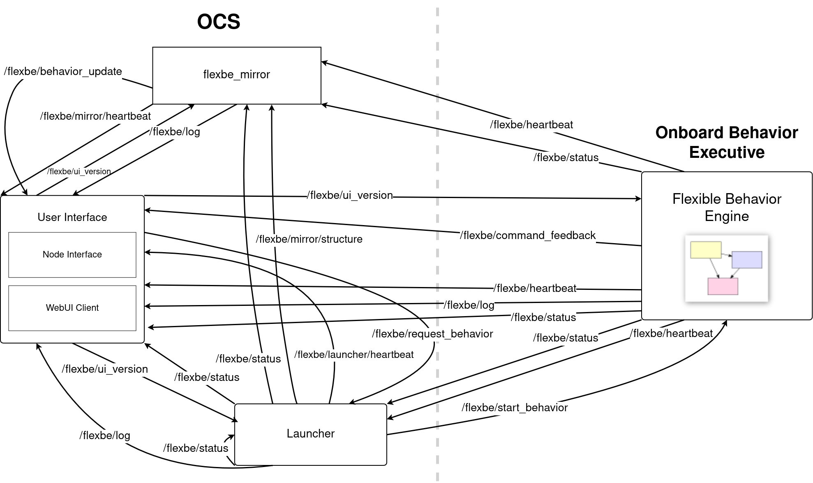

Detailed Overview
=================

This section covers the foundations of FlexBE, providing a detailed overview of the separation between the Onboard Behavior Executive and the OCS.
It will also cover the implementation of publisher/subscriber topics and nodes.
If you're already aware of how FlexBE works, or prefer to simply get started, feel free to :ref:`jump ahead<Getting Started>`!

Nodes & Topics in FlexBE
------------------------

The following figure gives an overview of all ROS topics involved in communicating between the Onboard Behavior Executive and
the ROS nodes running at the Operator Control Station (OCS).

|

While this presentation focuses on the FlexBE WebUI interface, the basic control topics are the same for the older FlexBE App.

Listed below are some of the topics highlighted in the figure that communicate publisher/subscriber messages between the Onboard Behavior Executive and the OCS nodes.
You may also go to `topics.py <https://github.com/FlexBE/flexbe_behavior_engine/blob/ros2-devel/flexbe_core/flexbe_core/core/topics.py>`_ for the full list.

.. glossary::

    /flexbe/log
        Logger topic.

    /flexbe/behavior_update
        Active state information from Mirror to UI.

    /flexbe/command_feedback
        Feedback to OCS of command outcome.

    /flexbe/heartbeat
        Onboard behavior executive is alive.

    /flexbe/launcher/heartbeat
    /flexbe/mirror/heartbeat
        Clock seconds active.

    flexbe/mirror/structure
        Pass behavior structure back to mirror.

    /flexbe/request_behavior
        Request from OCS to start a particular behavior.

    flexbe/start_behavior
        OCS or launcher command to start behavior.

    /flexbe/status
        Onboard behavior engine status.

    /flexbe/ui_version
        OCS Version topic.

.. <---- Anything with the '..' dictates a comment, which will not appear on documentation.

    .. FlexBE
    ..     Flexible Behavior Engine - an executive and user interface system for designing and executing robot behaviors.

    .. Onboard
    ..     The executive and other software running "on board" the robot.

    .. OCS
    ..     Operator Control Station. Software and user interfaces allowing operators to control and monitor the robot's behaviors.

    .. Publisher
    ..     In the context of ROS (Robot Operating System), a publisher is a node that sends messages to a specific topic.

    .. Subscriber
    ..     A subscriber is a node that receives messages from a specific topic.

.. **Coming soon!**
