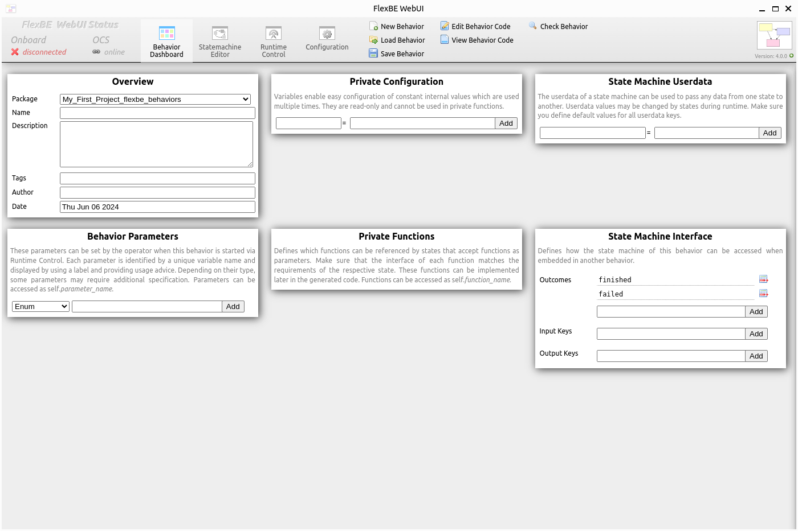

Creating A New Behavior
=======================

.. note::

  For the sake of this documentation, we will be grabbing images from the local client.
  However, please note that this can also be run through a browser. We recommend trying
  both methods to see which works best for your needs.

First, launch the *FlexBE WebUI* and run the user interface:

.. code-block:: console

  ros2 launch flexbe_webui flexbe_ocs.launch.py

This is the *Behavior Dashboard*. Here you can create new state behaviors and add local parameters and variables to your state machine.

|

First, let's start by giving your new behavior a name, describing it, and giving it an author.

In the *Overview* section of the *Behavior Dashboard*, type in the following:

|

We would like our new behavior to print a **"Hello World!"** message when executing it.
In the *Private Configuration* section of the dashboard, constant values of the behaviors can be defined.
This serves as a single point of change for any value required by the behavior.

So let's define a new string named **hello** for our message:

|

Add the new string by clicking the ``Add`` button. We will use it later.

Also, we want our behavior to wait some time before printing the message.
However, the time to wait should not be constant.
Instead, we want the operator to select a value when he starts execution of the behavior.
For this purpose, *Behavior Parameters* are available.

Select ``Numeric`` as type of the new parameter and name it **waiting_time**.

|

Add the parameter and edit its properties by clicking on the pencil icon:

|

The unit we'll be using is in seconds, because we will use this value later to pass it to a state which waits for the given amount of seconds.

You can now enter reasonable values for the waiting time as shown below:

|

To leave the property view of the parameter and have the list of all parameters displayed again, click on the arrow icon at the top of this box.

We started creating our new behavior by defining some values (one constant, one variable) and can now proceed to define the *State Machine* of the behavior.
Your *Behavior Dashboard* should now look like shown below:

|

That's it! Click *Statemachine Editor* at the top to switch to the editor and continue with the next tutorial by cicking 'Next'.