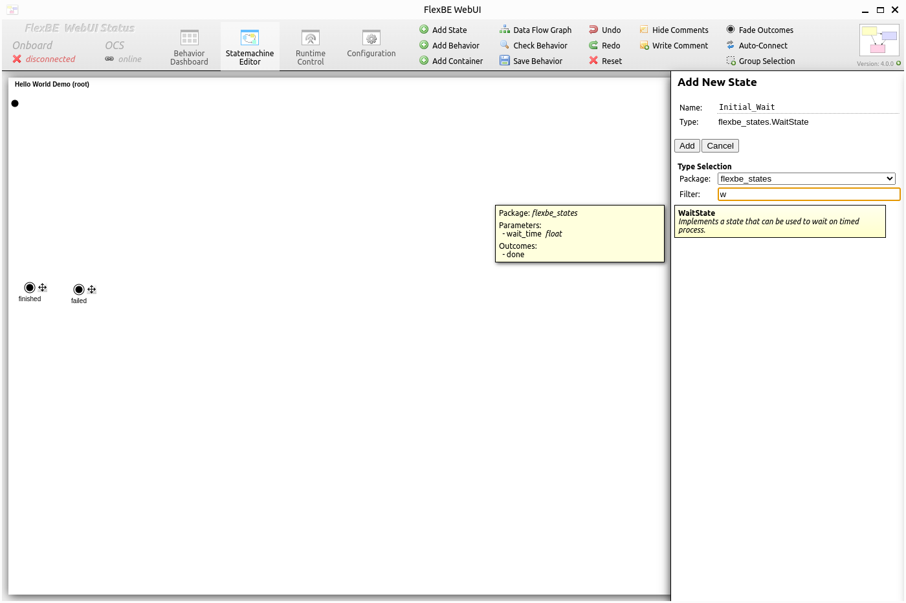
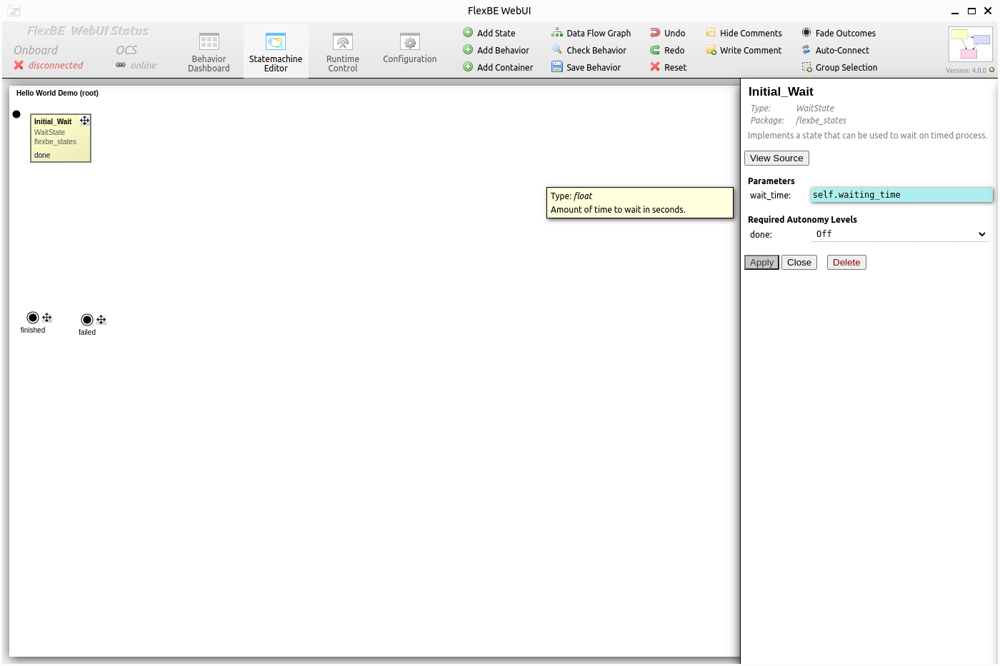
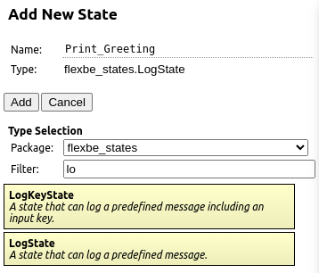
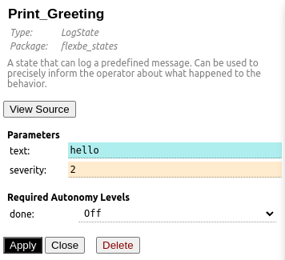
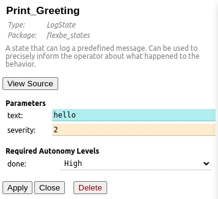
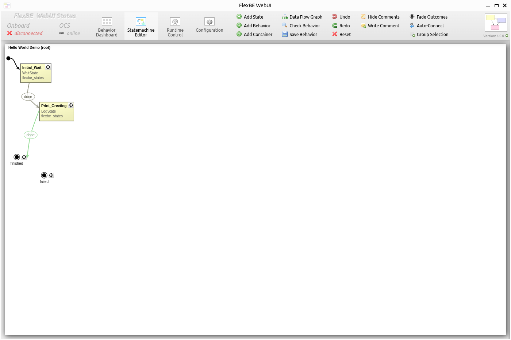

Using the Statemachine Editor
=============================

Start implementing the behavior by adding its first state.

As written in :ref:`creating a new behavior<Creating A New Behavior>`, we want our behavior to wait for some time and then print a message.
So our first state will be a state which waits a given amount of seconds.

Click ``Add State`` at the top, enter a name for the new state and select ``WaitState`` from the list below.
Entering something like "wait" in the class filter will help to quickly find the state and would also help if we didn't know the exact name and just need any state for waiting.

.. note::

   the *FlexBE WebUI* knows about the states from the export statements of the respective ROS packages that are sourced.
   In case the list is empty, close the app, open a new terminal, make sure that you sourced your workspace (e.g., verify that ``ros2 cd flexbe_states`` works) and run the app in this terminal.

Now click ``Add`` to add the new state to the behavior state machine.

The properties of the newly added state will pop up.
This panel can also be displayed by clicking on the state.

Since we already defined a parameter for the waiting time, we can use it now.
References to parameters always start with a **self.** in front of the parameter name.
This helps to distinguish between parameters and constants.
However, you can just start typing **waiting_time** and let autocompletion do the rest:

|

Click ``Apply`` to make this change permanent.

Next, we add our second state the same way. This time, it's a ``LogState`` as shown below because now we want to print our message:

|

This state has two parameters which we can now edit in the properties panel.

The first one is the text to be printed.
As we did for the waiting state, we won't enter an explicit value, but instead refer to one of our already defined values.
So, just enter the name of our message string, **hello**, as value of the text parameter.
As soon as you click ``Apply``, you will also see its value as tooltip when hovering over the text field.
Note that entering an explicit value (string in this case) would require quotes in contrast to referencing a variable, just like you entered in the value field of the **hello** variable.

The second parameter defines the type of the message such as error or warning.
The default value should be fine this time.
Normally, behavior hints are used to give explicit instructions or reminders to the operator when he is expected to do something.

|

This time, we will also change the required level of autonomy of this state's outcome.
Select ``High`` and apply the change. The meaning of this *Autonomy Level* is explained in the next tutorial.

|

Now connect the added states.

Start with setting the initial state by clicking on the black bullet next to the waiting state first, and then clicking on the waiting state to connect it to the bullet.
You may also change the position of the states by dragging them at their top right corner (indicated by a move icon).

The unconnected outcomes of each state are listed at the bottom of each state's visualization.
First, click on the outcome you want to connect and then click on the target.
The two bullets at the bottom of the state machine are the outcomes of the state machine itself.
You can ignore the outcome ``failed`` for now.

Your state machine should now look similar to the one shown below:

|

The green color of the second transition refers to its required autonomy level.

Now click ``Save Behavior``.
This will generate all files required for executing the new behavior.
After saving, you can close the *FlexBE WebUI*.

.. note::

  When you create a new behavior, the behavior name is used to generate the filename (e.g., "Example 1" becomes "example_1").
  After the filename is created, changing the behavior name will **not** change the filename!
  The filename remains as initially generated.

That's it! You are ready to execute your first behavior. Click 'Next' to go to the next tutorial.