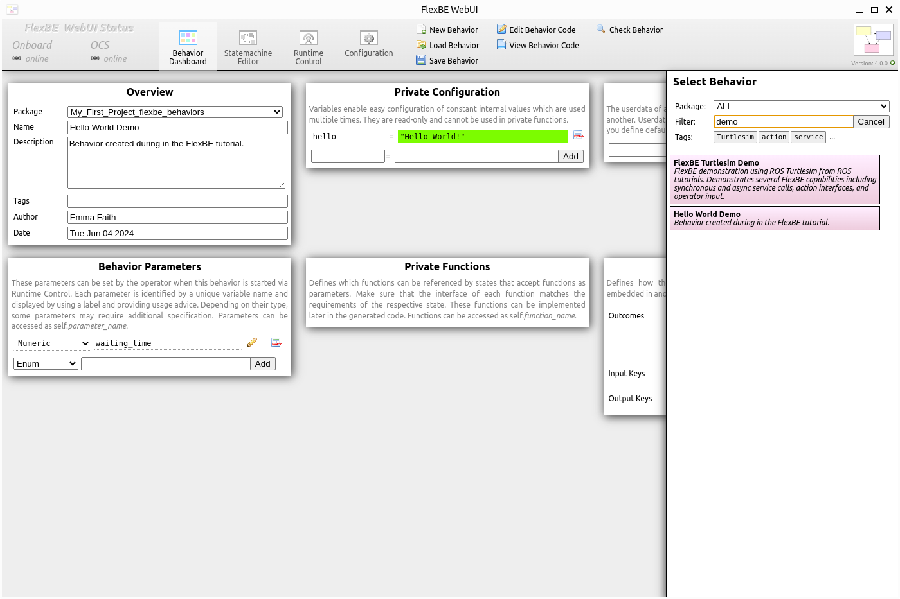

Execution of a Behavior
=======================

Now we want to execute a behavior.

This means, it is no longer sufficient to just launch the *FlexBE WebUI* through the OCS.
Instead, we need to launch the whole behavior engine.
This can be done by executing the following command:

.. code-block:: console

 ros2 launch flexbe_webui flexbe_full.launch.py

This launches **both** the onboard and OCS software in a single terminal.  This is suitable for these tutorials on a single machine.
For deployment on a robot, the onboard and OCS software must be started seperately.

First, you have to load the previously created behavior.
This is done by clicking on the ``Load Behavior`` button at the top and then selecting your **Hello World Demo** in the list of available behaviors.
Similar to choosing a class when adding a new state, you can again start typing parts of the name into the filter text field to quickly find what you are looking for:

|

Now, switch to the *Runtime Control* view of the user interface.
It should look like shown below:

|

In order to run the behavior, now click the green ``Start Execution`` button.
As soon as you click the button, several things will happen.
The user interface informs the onboard engine as well as the behavior mirror.
The mirror will create a behavior with the same structure as the onboard behavior in order to provide meaningful information by just receiving minimal data from onboard, while the onboard engine now imports the sent behavior, builds it, and starts execution.

When everything is running as it should, the main panel will display the first state of our behavior as the currently active state, as shown below:

|

The active state is always displayed in the center of the panel in blue color.
On the right, you can see possible outcomes of the state including the state which would be executed next.

After two seconds, the behavior continues with the next state:

|

As you can see now, the behavior does not continue after reaching the second state.
Instead, it highlights the outcome and asks for permission to execute it.
We will allow it in a moment, but first, take a look at the bottom panels.
You can now see the **"Hello World!"** message displayed in the feedback panel, as well as a documentation of the ``LogState`` in the documentation panel.

Allow the requested outcome by clicking on the highlighted arrow.
You can click on outcomes at any time, even if they are not highlighted, in order to force them.
The behavior will immediately return outcomes requested in this way, so it is your responsibility to decide whether an outcome should be forced.
After permitting the outcome, the demo behavior finishes.

Let's do a second run of this behavior, but this time, we change the default settings.

Increase the waiting time to four seconds and change the *Autonomy Level* to ``Full`` by selecting the respective entry at the control panel.
Changing the *Autonomy Level* can be done at any time, no matter if a behavior is running or not:

|

The *Autonomy Level* was the reason why behavior execution stopped during the first run.
We just allowed transitions requiring less than low autonomy which only applies for the most basic transitions.
Each transition that required at least low autonomy was blocked and our second transitions requires high autonomy as we configured in the last tutorial.
This means, as observed, the behavior will not execute the transition autonomously, but instead indicates that it is ready to be executed and waits for permission.
Since we now set the autonomy to ``Full``, behavior execution does not stop at the transition this time.

That's it! Now that you know how to create simple behaviors, learn about developing basic states by clicking 'Next'.