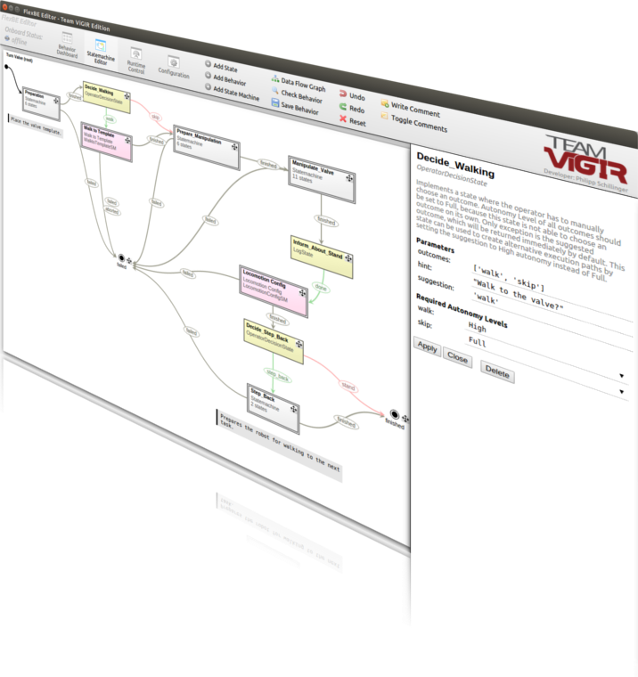

Getting Started
===============

This documententation will take you though the process of installing ROS 2 and the FlexBE WebUI application.
For information on how to install the FlexBE WebUI for other ROS distributions, see `here <https://github.com/FlexBE/flexbe_webui.git>`_.

Background
----------

This document assumes familiarity with working with ROS build systems, at a minimum one should be familiar with:

   * Navigating your system through command lines. See `here <https://www.digitalocean.com/community/tutorials/linux-commands>`_ for some basic Linux terminal commands.
   * Git code management tool (i.e. ``git clone``, ``git push``, etc.)
   * Editing and "sourcing" shell startup scripts (i.e. ``.bashrc``)
   * A basic understanding of `ROS 2 <https://docs.ros.org/>`_ build systems.

Installation
------------

1 Install ROS Distribution
~~~~~~~~~~~~~~~~~~~~~~~~~~

Install the `ROS 2 binary packages <https://docs.ros.org/en/jazzy/Installation.html>`_ as described in the official documentation.
Make sure you are able to run a C++ ``talker`` and Python ``listener`` before moving on!

.. note::
   In order to execute commands such as ``talker`` and ``listener`` in ROS 2, it is essential to source the appropriate setup files on **every new shell you open**.
   To avoid manually sourcing the setup files every time, we recommend adding the sourcing `command <https://docs.ros.org/en/jazzy/Tutorials/Beginner-CLI-Tools/Configuring-ROS2-Environment.html#add-sourcing-to-your-shell-startup-script>`_ to your shell's startup script.

2 Create the ROS 2 Workspace
~~~~~~~~~~~~~~~~~~~~~~~~~~~~

Open up a new terminal or run ``clear``. Then create a new ROS 2 workspace by typing in the following:

.. code-block:: console

 mkdir -p ~/[your_ros_workspace]/src # Makes a new ROS Workspace
 cd ~/[your_ros_workspace] # Changes the working directory

3 FlexBE WebUI System Configuration
~~~~~~~~~~~~~~~~~~~~~~~~~~~~~~~~~~~

Next, we will install the required FlexBE WebUI libraries.
For more information on this default setup, go :ref:`here<System Configuration>`.
Otherwise, clone the following repos into your ROS workspace:

.. code-block:: console

 git clone https://github.com/FlexBE/flexbe_behavior_engine.git  # if not already present from binary install
 git clone https://github.com/FlexBE/flexbe_webui.git

.. note::

 ``flexbe_behavior_engine`` can either be installed from binaries or built from source, but interacting with the user interface requires building from source at this time.

Make sure that the branches are consistent (e.g. ``git checkout ros2-devel``).

Install any required dependencies:

.. code-block:: console

 cd ~/[your_ros_workspace]
 rosdep update
 rosdep install --from-paths src --ignore-src

Build your workspace using ``colcon``:

.. code-block:: console

 colcon build

After successfully building the workspace, you'll need to set up the environment.
Source the ``local_setup.bash`` file:

.. code-block:: console

 . install/local_setup.bash

Finally, the ``flexbe_webui`` requires consistent versions of several Python dependencies.
To ensure that these Python packages are properly installed, go to the ``flexbe_webui`` folder and type in the following:

.. code-block:: console

 cd ~/[your_ros_workspace]/src/flexbe_webui
 pip install -r requires.txt

You have now officially installed the FlexBE WebUI onto your machine. Congratulations!

4 Building Your FlexBE Repository
~~~~~~~~~~~~~~~~~~~~~~~~~~~~~~~~~

In order to create and prepare a new repository for behavior development, run the following script in your ROS workspace and pass the name of your project or identifier:

.. code-block:: console

 cd ~/[your_ros_workspace] # If not already in ROS workspace
 ros2 run flexbe_widget create_repo [your_project_name]

This will initialize a new local git repository with the correct workspace structure which you can then push to a desired remote location.
Make sure you ``colcon build`` the ROS workspace afterwards.

5 Using the FlexBE Web-Based User Interface
~~~~~~~~~~~~~~~~~~~~~~~~~~~~~~~~~~~~~~~~~~~

This UI uses native Python and FastAPI along with a JavaScript-based web browser interface to interface with the Flexible Behavior Engine.

**To run the full OCS, including Python node and PyQt5-based WebClient UI, with the onboard engine seperately:**

.. code-block:: console

 ros2 launch flexbe_onboard behavior_onboard.launch.py

.. code-block:: console

 ros2 launch flexbe_webui flexbe_ocs.launch.py

..  * ``ros2 launch flexbe_onboard behavior_onboard.launch.py``

..  * ``ros2 launch flexbe_webui flexbe_ocs.launch.py``

This will launch the onboard behavior executive and the full FlexBE OCS in separate terminals.

For more detailed start-up instructions, please check out the `flexbe_webui/README <https://github.com/FlexBE/flexbe_webui.git>`_.
This includes options for browser based interaction in addition to the `flexbe_webui client`.

Similar instructions are available for the older `flexbe_app/README <https://github.com/FlexBE/flexbe_app.git>`_.

Next Steps
----------

Now that you have ROS and the FlexBE WebUI operational, let's dive into some foundational core concepts of FlexBE.

Click 'Next' to jump into the "Quick Start" FlexBE Demos.
