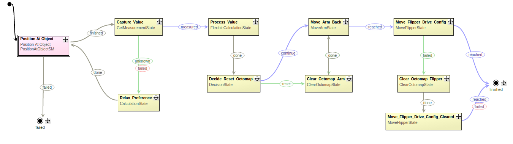
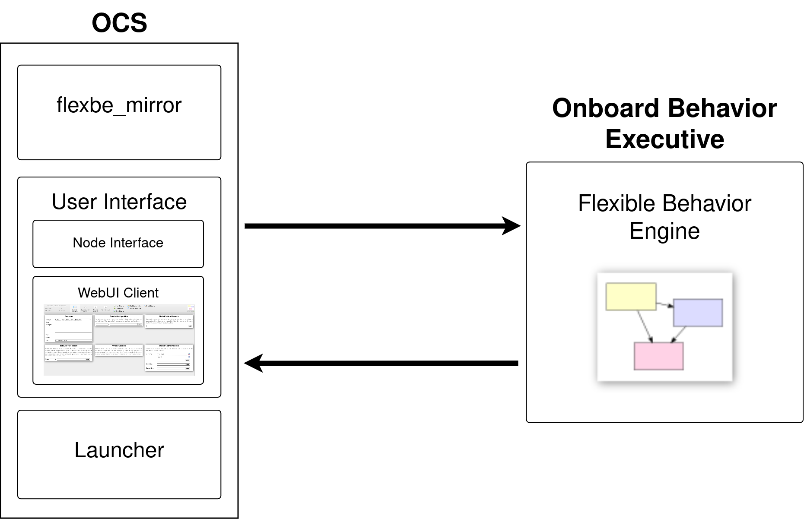

FlexBE - The Flexible Behavior Engine
================================================

Overview
---------

.. **FlexBE** is a powerful and user-friendly high-level behavior engine, applicable to numerous systems and scenarios.

**FlexBE** is a powerful and user-friendly high-level behavior engine for the Robotic Operation System (ROS).
Both ROS 1 (Noetic) and ROS 2 versions are `available here <https://github.com/FlexBE>`_.

FlexBE is designed to ease the development and execution of complex robotic behaviors through the use of Hierarchical Finite State Machines (HFSMs).

|

FlexBE enables a non-developer operator to make adjustments to behaviors during runtime in
situations where the exact scenario the robot will be facing is not known in advance.

FlexBE includes both an Onboard (robot) Behavior Executive and an Operator Control Station (OCS) for supervisory control
and *collaborative autonomy* through adjustable autonomy levels.
The unique separation between the Onboard behavior and the OCS allows for distinct roles and responsibilities,
ensuring efficient and coordinated robotic operation.

The **Onboard Behavior Executive (OBE)** is responsible for coordinating the execution of Python-based state implementations.
It typically runs on the robot's onboard computer and communicates with the OCS through a wireless network.

The **Operator Control Station (OCS)** provides a user-friendly interface through the FlexBE WebUI, which simplifies the
development of HFSMs.
This extensive user interface allows users to load, save, configure, and monitor runtime execution of HFSM
by the OBE, and also supports behavior creation and runtime modification of executing behaviors.

|

FlexBE, initially developed by Philipp Schillinger and Team ViGIR during the DARPA Robotics Challenge, promotes
*collaborative autonomy* by facilitating seamless communication and coordination between the OBE and OCS systems.
This collaborative approach enables human operators to interact with autonomous robots on a high level when necessary through its
adjustable levels of autonomy, harnessing the strengths of both human intelligence and robotic capabilities to achieve mission objectives efficiently.
The user interface is designed to reduce the cognitive load on the operator while the robot is in the field,
and reduce errors by running verification checks and automatically generating syntax-error-free code.
See the :doc:`bibliography` for more details.

Primarily, FlexBE is designed as a high-level behavioral controller.
It is not focused on high-rate, low-level, safety-critical use cases;
in a typical use case, FlexBE would be used to supervise such controllers and allow an operator to guide the system recovery.

FlexBE offers two user interfaces: the standalone `FlexBE App <https://github.com/FlexBE/flexbe_app>`_ and the `FlexBE WebUI <https://github.com/FlexBE/flexbe_webui>`_.
The WebUI, which supersedes the FlexBE App, provides enhanced functionality for creating and managing robot behaviors.
Both versions of the software are supported, and the basic commands are the same.

Whether managing autonomous missions in hazardous environments, performing intricate manipulation tasks in manufacturing settings, or
assisting with search and rescue operations, FlexBE empowers users to develop and deploy complex robotic behaviors with ease and confidence!

To get started, click :ref:`here <Getting Started>`!

.. toctree::
   :hidden:

   index
   gettingstarted
   quickstart
   basictutorials
   advancedtutorials
   technicaldetails
   contribution
   extensions
   applications
   bibliography
   contactinfo
