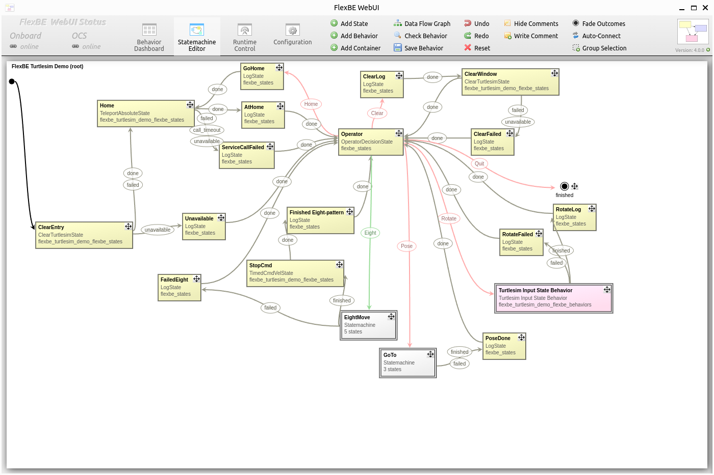
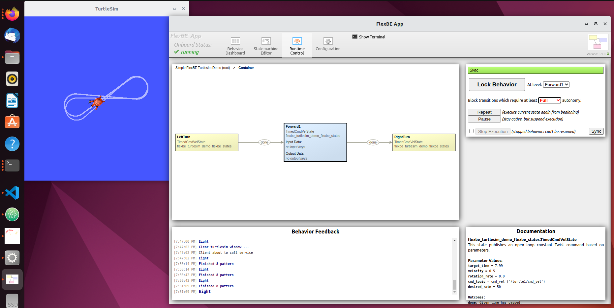
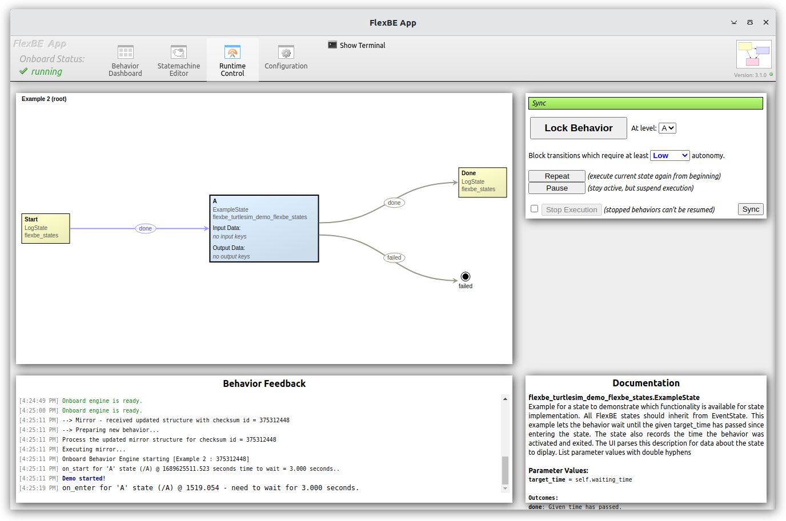
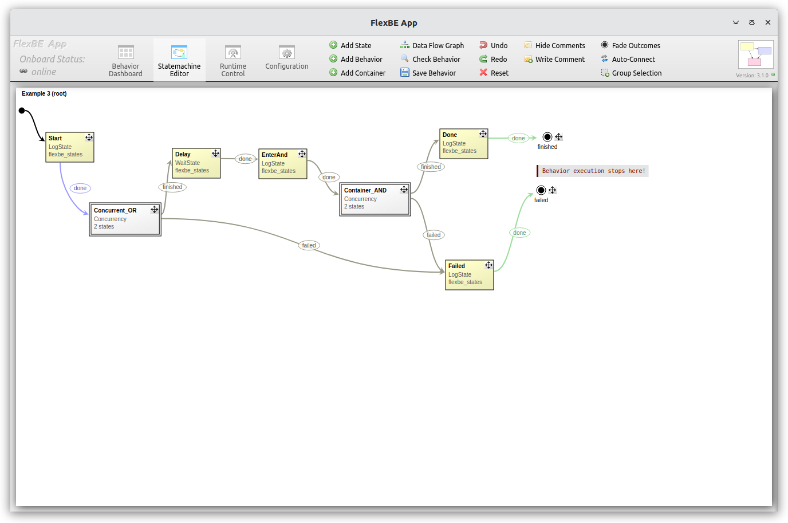
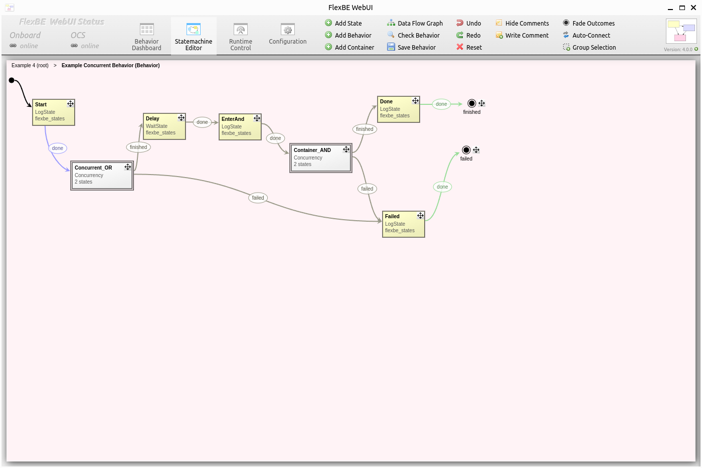

"Quick Start" FlexBE Demos
==========================

The following tutorials are designed to give you a hands-on introduction to the core features and functionalities of FlexBE.

This tutorial provides a self contained introduction to FlexBE with a "Quick Start" based on the simple 2D ROS Turtlesim simulator.

The linked repository below provides all of the flexbe_turtlesim_demo-specific states and behaviors
to provide a simple demonstration of FlexBE's capabilities using a minimal number of the ROS packages.

Installation
------------

In addition to the standard FlexBE packages, clone this repo into your ROS workspace:

.. code-block:: console

 git clone https://github.com/flexbe/flexbe_turtlesim_demo.git

Make sure that the branches are consistent (e.g. ``git checkout ros2-devel``) with the *FlexBE WebUI* and Behavior Engine installations.

Install any required dependencies.
Make sure you build your workspace afterwards:

.. code-block:: console

 rosdep update
 rosdep install --from-paths src --ignore-src
 colcon build

Turtlesim Quick Start Demonstration
-----------------------------------

Please see the `flexbe_turtlesim_demo <https://github.com/FlexBE/flexbe_turtlesim_demo?tab=readme-ov-file#quick-start-usage>`_ repo for the latest up-to-date tutorial.

|

Example 1 Demo
--------------

Example 1 described in `flexbe_turtlesim_demo <https://github.com/FlexBE/flexbe_turtlesim_demo/blob/ros2-devel/docs/example1.md>`_ provides the simplest "Hello World"
in FlexBE. This demonstration allows you to load and execute the simplest example, which we describe in detail in :ref:`Creating A New Behavior` basic tutorial.
In this example distributed with the *flexbe_turtlesim_demo*, the focus is on loading existing behaviors.

|

Example 2 Demo
--------------

Example 2, outlined in `flexbe_turtlesim_demo <https://github.com/FlexBE/flexbe_turtlesim_demo/blob/ros2-devel/docs/example2.md>`_, builds upon 
the foundational concepts introduced in Example 1. This demonstration guides you through a simple state machine consisting of three states. 
As detailed in the :ref:`Using the Statemachine Editor` tutorial, Example 2 dives into the implementation of your own states.

|

Example 3 Demo
--------------

Example 3 described in `flexbe_turtlesim_demo <https://github.com/FlexBE/flexbe_turtlesim_demo/blob/ros2-devel/docs/example3.md>`_ demonstrates a
``ConcurrencyContainer`` in FlexBE for concurrent state execution. It showcases both OR and AND style behaviors, allowing users to adjust wait times and observe 
state interactions. For further exploration, proceed to Example 4 to delve into nested state machines using a StateMachine container.

|

Example 4 Demo
--------------

Example 4 described in `flexbe_turtlesim_demo <https://github.com/FlexBE/flexbe_turtlesim_demo/blob/ros2-devel/docs/example4.md>`_ demonstrates a three-layer
Hierarchical Finite State Machine (HFSM) in FlexBE, extending the behavior of Example 3 within a Behavior container. Explore this example to get a better
understanding of hierarchical state machine design in FlexBE.

|

Click 'Next' to get started with some basic tutorials.
