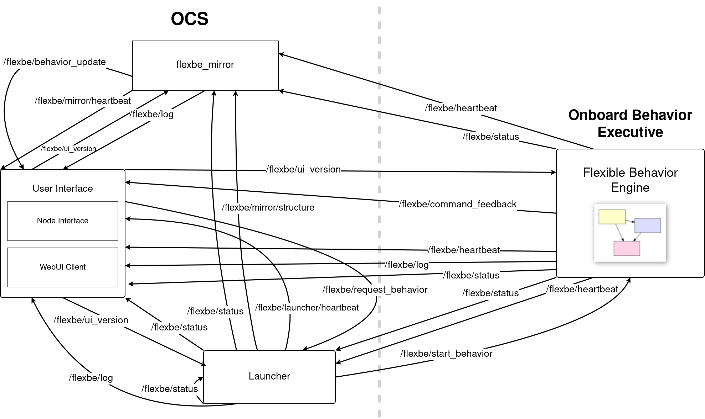

Technical Details
=================

This section covers the foundations of FlexBE, providing a detailed overview of the separation between the Onboard Behavior Executive and the OCS.
It will also cover the implementation of publisher/subscriber topics and nodes.

See our :doc:`bibliography` for formal reference citations and further details.

FlexBE Control
--------------

FlexBE uses standard ROS topics to control the Onboard Behavior Engine (OBE) via the User Interface (UI).

The following figure gives an overview of all ROS topics involved in communicating between the Onboard Behavior Executive and
the ROS nodes running at the Operator Control Station (OCS).

|

While this presentation focuses on the FlexBE WebUI interface, the basic control topics are the same for the older FlexBE App.

Listed below are some of the topics highlighted in the figure that communicate publisher/subscriber messages between the Onboard Behavior Executive and the OCS nodes.
You may also go to `topics.py <https://github.com/FlexBE/flexbe_behavior_engine/blob/ros2-devel/flexbe_core/flexbe_core/core/topics.py>`_ for the full list.

.. glossary::

    /flexbe/log
        Logger topic.

    /flexbe/behavior_update
        Active state information from Mirror to UI.

    /flexbe/command_feedback
        Feedback to OCS of command outcome.

    /flexbe/heartbeat
        Onboard behavior executive is alive.

    /flexbe/launcher/heartbeat
    /flexbe/mirror/heartbeat
        Clock seconds active.

    flexbe/mirror/structure
        Pass behavior structure back to mirror.

    /flexbe/request_behavior
        Request from OCS to start a particular behavior.

    flexbe/start_behavior
        OCS or launcher command to start behavior.

    /flexbe/status
        Onboard behavior engine status.

    /flexbe/ui_version
        OCS Version topic.

FlexBE State Lifecycle
----------------------

FlexBE invokes Python-based state implemenation files that are derived from the
FlexBE `EventState <https://github.com/FlexBE/flexbe_behavior_engine/blob/ros2-devel/flexbe_core/flexbe_core/core/event_state.py>`_ class.

The following illustration shows the lifecycle of a state along with associated events.
When a new behavior is executed, this lifecycle is started for all states contained anywhere in
the hierarchy of the behavior (including states of contained behaviors).

First, all states are instantiated and thus, their constructor is called.
Afterwards, i.e., when execution of the constructor of all states has finished, the ``on_start`` event is triggered for all states.
Then, the initial state becomes active. Whenever a state becomes active, its ``on_enter`` event is triggered once.
Then, it periodically (default: 10 hz) calls its ``execute`` function to check for exit conditions and if an outcome is returned,
the ``on_exit`` event is triggered once before the next state becomes active. Finally, if an outcome of the root-level state machine
is returned or execution of the behavior is stopped manually, the on_stop event of all states is triggered in order to clean up.

Note that ``on_start`` and ``on_stop`` are triggered exactly once for each state (concurrently) per behavior execution.
The methods ``on_enter`` and ``on_exit`` are triggered once when the associated state becomes active or inactive; however,
since a state can become active multiple times, these events can be triggered multiple times during a behavior execution.

.. code-block:: python

    def on_start(self):

This method is called when the behavior is started. If possible, it is generally better to initialize used
resources in the constructor because if anything failed, the behavior would not even be started.

.. code-block:: python

    def on_enter(self, userdata):

This method is called when the state becomes active, i.e., a transition from another state to this one is taken.
It is primarily used to start actions which are associated with this state or initialize variables which may
have changed during a previous execution.

.. code-block:: python

    def execute(self, userdata):

This function is called periodically while the state is active.
Main purpose is to check state conditions and trigger a corresponding outcome.
If no outcome is returned, the state will stay active.

This method should return quickly.  For longer running operations consider making an asynchronous call
in on enter, and monitor the response here.

.. code-block:: python

    def on_exit(self, userdata):

This event is triggered when an outcome is returned and another state gets active.
It can be used to stop possibly running processes started by on_enter.

.. code-block:: python

    def on_stop(self):

This event is triggered whenever the behavior stops execution, also if it is cancelled.
Use this event to clean up things which are claimed or running even if the state is not active.
If you use proxies for subscribing etc., you do not need to unsubscribe.

.. code-block:: python

    def on_pause(self):

This event is triggered when the operator clicks on the Pause button in the user interface or execution is paused
automatically, e.g., because of a priority container becoming active and interrupting this state.
It is recommended to implement this event such that all actions commanded by this state do not affect the robot while being paused.
Note that the execute loop is not being called while the state is paused, so you don't need to stop this part explicitly.
One option is to implement this event similar to on_exit.

.. code-block:: python

    def on_resume(self, userdata):

Complement to on_pause, i.e., this event is triggered when execution resumes after having been paused.
Make sure that everything that is explicitly stopped in on_pause is continued.
One option is to implement this event similar to on_enter.

.. <---- Anything with the '..' dictates a comment, which will not appear on documentation.

    .. FlexBE
    ..     Flexible Behavior Engine - an executive and user interface system for designing and executing robot behaviors.

    .. Onboard
    ..     The executive and other software running "on board" the robot.

    .. OCS
    ..     Operator Control Station. Software and user interfaces allowing operators to control and monitor the robot's behaviors.

    .. Publisher
    ..     In the context of ROS (Robot Operating System), a publisher is a node that sends messages to a specific topic.

    .. Subscriber
    ..     A subscriber is a node that receives messages from a specific topic.

.. **Coming soon!**
